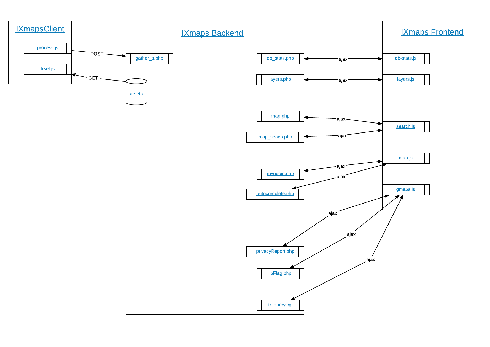

## High level overview


Interactive version at https://www.ixmaps.ca/ecosystem.php

### Server setup
Website setup
```
git clone git@github.com:ixmaps/website2017.git /var/www/ixmaps/
cp config.example.json config.json
nano config.json (add key and change php-backend)
ln -s /var/www/php-backend/application/ application/
cp -R /var/www/ixmaps-old/IXmapsClient /var/www/ixmaps/
cp -R /var/www/ixmaps-old/trsets /var/www/ixmaps/
cp -R /var/www/ixmaps-old/piwik/ /var/www/ixmaps/ (permissions issues)
chmod -R www-data piwik
chgrp -R www-data piwki
npm install
bower install
grunt
```

PHP setup
```
```

Script setup
```
```
