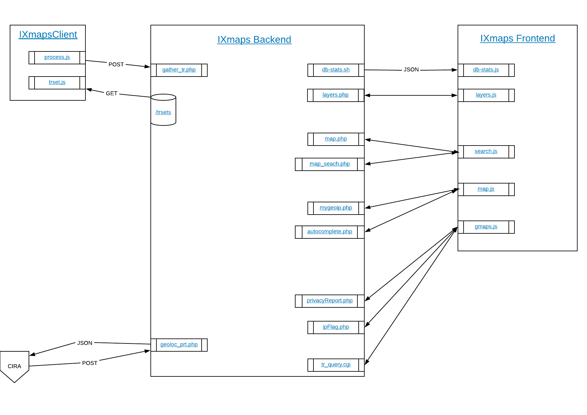

## High level overview


Interactive version available at https://www.ixmaps.ca/documentation.php

### IXmaps backend
https://github.com/ixmaps/php-backend  
https://github.com/ixmaps/ixmaps-bin

### IXmaps frontend
https://github.com/ixmaps/website2017

### IXmapsClient
https://github.com/ixmaps/IXmapsClient

### Server setup
#### Website setup
```
git clone git@github.com:ixmaps/website2017.git /var/www/ixmaps/
cd ixmaps
cp config.example.json config.json
nano config.json (add key, modify php-backend)
ln -s /var/www/php-backend/application/ application/
cp -R /var/www/ixmaps-old/IXmapsClient /var/www/ixmaps/
cp -R /var/www/ixmaps-old/trsets /var/www/ixmaps/
cp -R /var/www/ixmaps-old/piwik/ /var/www/ixmaps/ (permissions issues)
chmod -R www-data piwik
chgrp -R www-data piwki
npm install
bower install
grunt
```

#### PHP setup
```
git clone git@github.com:ixmaps/website2017.git /var/www/php-backend/
cd php-backend/application
cp config.sample.php config.php
nano config.json (add dppassword, modify webUrl if necessary)
ln -s /var/www/php-backend/application/ application/ ??
php-util ??
```

#### Script setup
```
git clone git@github.com:ixmaps/cgi-bin.git /var/www/cgi-bin/
git clone git@github.com:ixmaps/ixmaps-bin.git /home/ixmaps/bin/
```

#### Maxmind data setup?
```
mkdir /home/ixmaps/ix-data/mm-data
python /home/ixmaps/bin/download_maxmind.py ??
```

#### Crontab setup  
User ixmaps
```
# download new Maxmind data file
0 2 15 * * /home/ixmaps/bin/download_maxmind.py

# geo correction 
*/10 * * * * /home/ixmaps/bin/corr-latlong.sh -n
*/20 * * * * php /var/www/php-backend/application/controller/geo_update_cities.php > /home/ixmaps/tmp/geo_update_cities.log
0 5 * * * /home/ixmaps/bin/corr-latlong.sh -u

# backups
35 4 * * * pg_dump ixmaps | gzip > /home/ixmaps/backup_daily/`date +\%Y\%m\%d`.sql.gz
21 4 * * 4 /bin/cp /home/ixmaps/backup_daily/*01.sql.gz /home/ixmaps/backup
21 4 * * 4 /bin/cp /home/ixmaps/backup_daily/*15.sql.gz /home/ixmaps/backup
22 4 * * 4 /usr/bin/find /home/ixmaps/backup_daily -type f -mtime +30 -delete

# concat all of the trsets into 00:_all_trsets.trset
30 5 * * * /home/ixmaps/bin/concat-trsets.sh

# create the helper tables for the DB
0 6 * * * /home/ixmaps/bin/create-extra-db-tables.sh

# collect last hop in tr_last_hops table
# 100 TR every 20 mins
5,25,40 * * * * php /var/www/php-backend/application/controller/collectLastHop.php > /home/ixmaps/tmp/collectLastHop_log
```
User root
```
# autorenewl of SSL certs
0 1 * * 1 /opt/letsencrypt/certbot-auto renew >> /var/log/le-renew.log
5 1 * * 1 service apache2 reload
```
